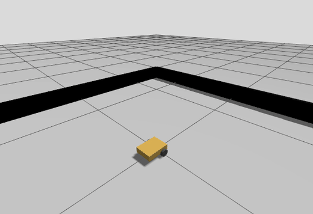

# Minibot: ESP32 + ROS 2 Jazzy differential-drive starter kit

A two-wheel robot that drives in Gazebo today and on a real ESP32 robot tomorrow, with the same controllers and launch files.



**Status:** free simulation version (v0.1.1), tested on ROS 2 Jazzy + Gazebo Harmonic. No hardware needed.

> **Want it to map a room and drive itself?** The [full Minibot kit](https://payhip.com/b/yocBZ) adds a simulated lidar, mapping with slam_toolbox and autonomous navigation with Nav2, all tested and documented. The ESP32 firmware and hardware interface for the real robot are coming soon.

## What you get
- `minibot_description`: robot model (URDF/xacro). All dimensions are at the top of `urdf/minibot.urdf.xacro`.
- `minibot_bringup`: Gazebo Harmonic world, ros2_control config (diff_drive_controller), launch file, and a drive test that prints PASS/FAIL.

## Requirements
Ubuntu 24.04 with ROS 2 Jazzy ([install guide](https://docs.ros.org/en/jazzy/Installation.html)), then:

```bash
sudo apt install ros-jazzy-desktop ros-jazzy-ros-gz ros-jazzy-gz-ros2-control \
  ros-jazzy-ros2-controllers ros-jazzy-xacro ros-jazzy-teleop-twist-keyboard \
  ros-jazzy-joint-state-publisher-gui python3-colcon-common-extensions
```

## Quick start
```bash
cd ros2_ws
source /opt/ros/jazzy/setup.bash
colcon build --symlink-install
source install/setup.bash

ros2 launch minibot_bringup sim.launch.py            # Gazebo + RViz
```

Drive it with the keyboard (in a second terminal, after sourcing):
```bash
ros2 run teleop_twist_keyboard teleop_twist_keyboard --ros-args \
  -p stamped:=true -r cmd_vel:=/diff_drive_controller/cmd_vel
```

Check everything works (prints PASS/FAIL):
```bash
ros2 run minibot_bringup drive_test.py
```

Run the automated tests (model/config checks, plus a headless Gazebo run of the drive test, about a minute):
```bash
colcon test && colcon test-result --verbose
```

No GPU or no display? Run `ros2 launch minibot_bringup sim.launch.py headless:=true rviz:=false` and use the drive test.

## Make it your robot
1. Measure your wheel radius and the distance between wheel centres.
2. Put them in **both** `minibot_description/urdf/minibot.urdf.xacro` and `minibot_bringup/config/controllers.yaml`.
3. Rebuild and rerun the drive test.

## Topics
| Topic | Type | |
|---|---|---|
| `/diff_drive_controller/cmd_vel` | `geometry_msgs/TwistStamped` | velocity commands in |
| `/diff_drive_controller/odom` | `nav_msgs/Odometry` | wheel odometry out |
| `/joint_states` | `sensor_msgs/JointState` | wheel positions/velocities |
| `/tf` | | `odom -> base_link -> wheels` |

## More docs
- `docs/how-it-works.md`: what each piece does, for beginners
- `docs/customize-your-robot.md`: change the dimensions to match your robot
- `ARCHITECTURE.md`: full design, interfaces and roadmap
- `TROUBLESHOOTING.md`: fixes for common errors

## Licence
MIT, © 2026 Minibot Kits. See `LICENSE`.
